# Atividade Site Kawase Soluções Digitais
## 💻 Projeto
Site feito no padrão MVC com acesso ao banco de dados no AspNet Core.
## :rocket: Tecnologias
✔️C#
✔️MySQL
✔️AspNet MVC
✔️HTML5
✔️CSS

## :camera: Imagens
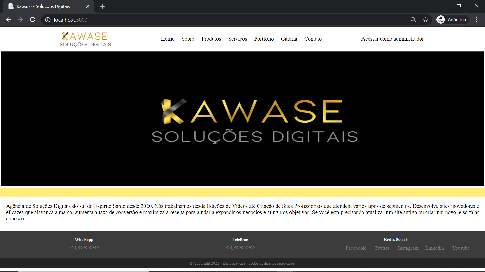
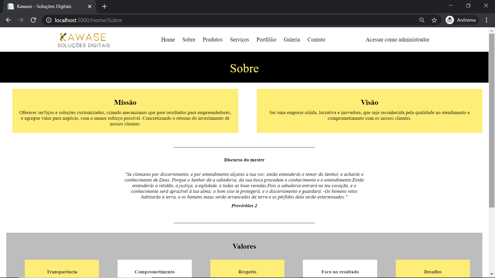
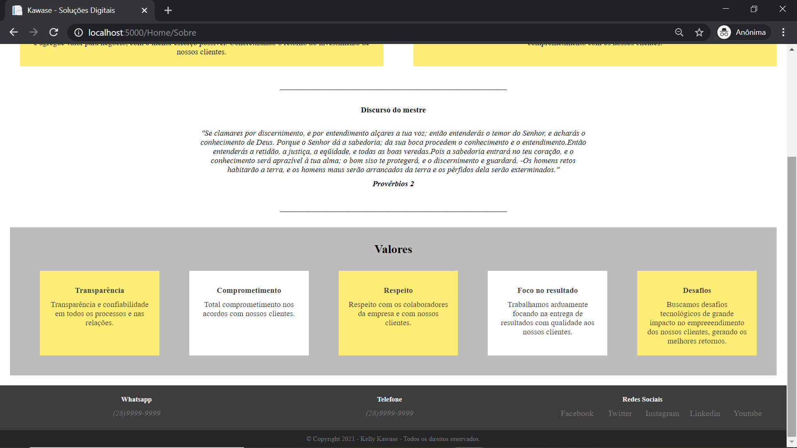
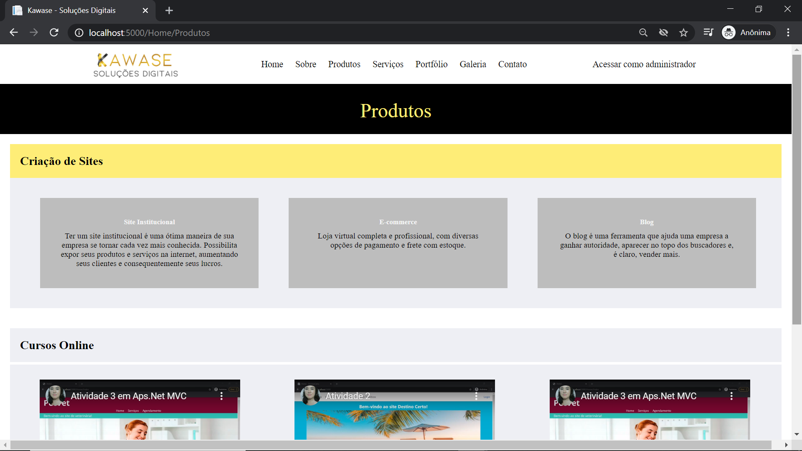
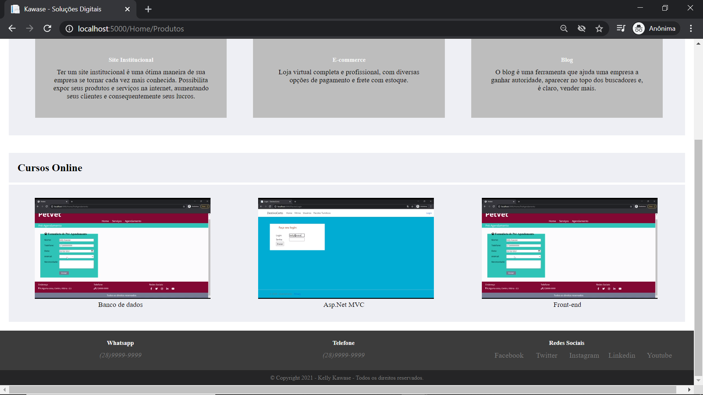
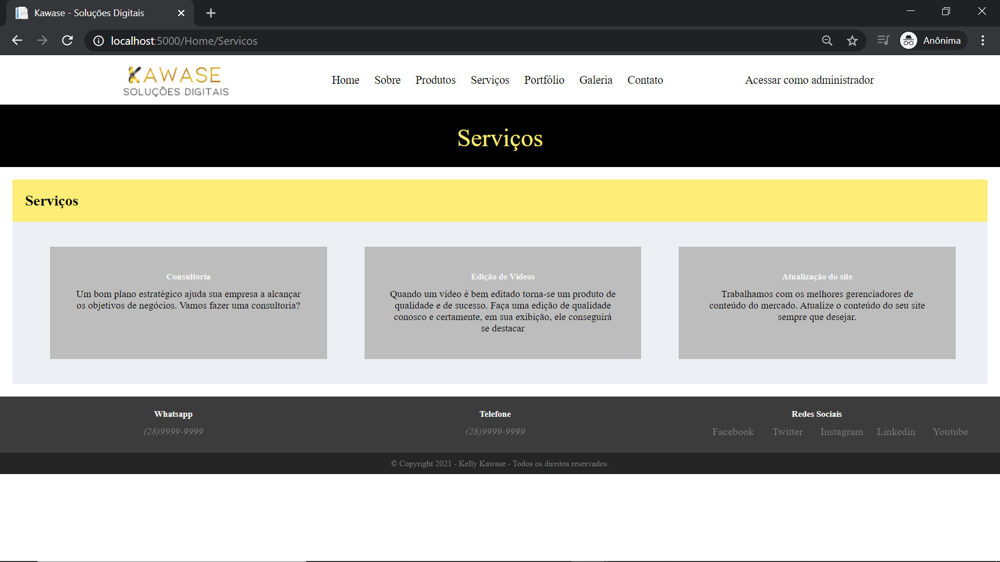
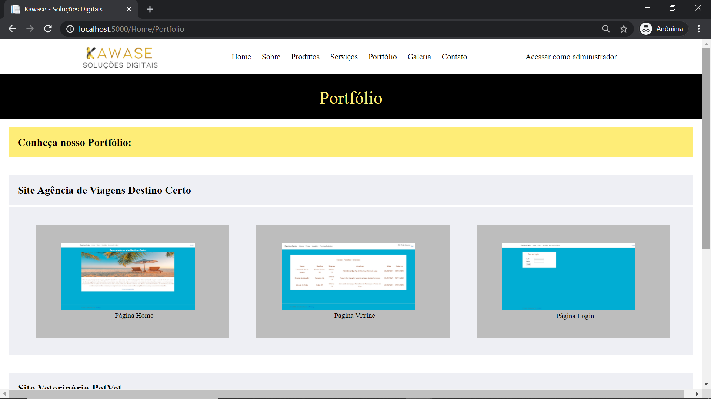
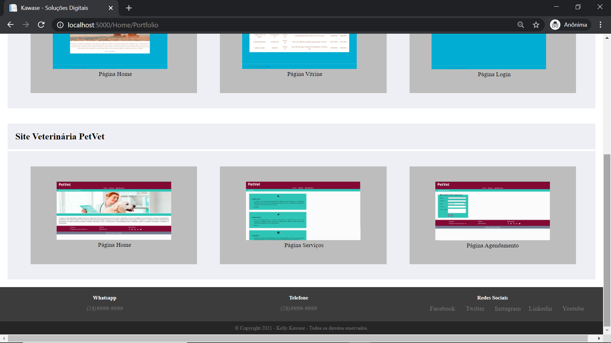
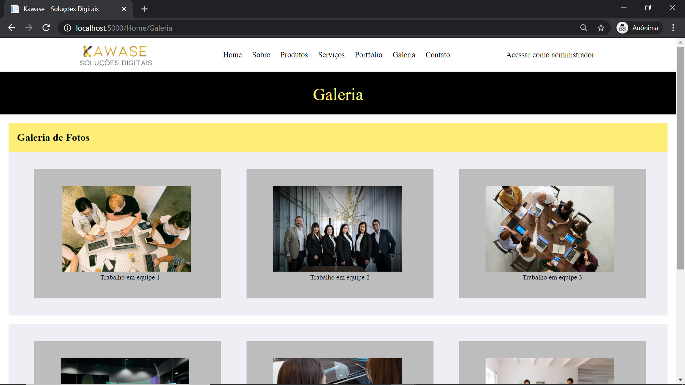
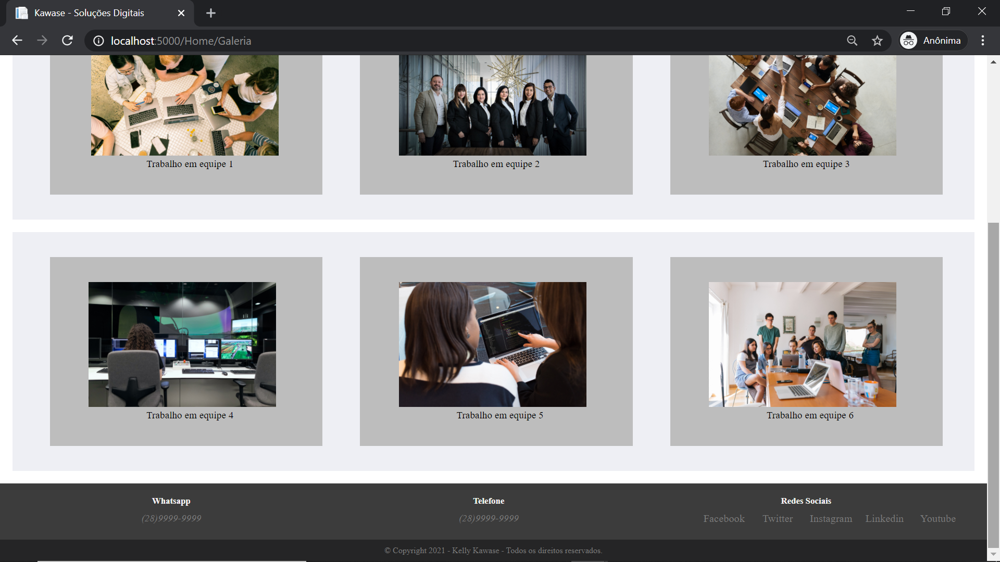
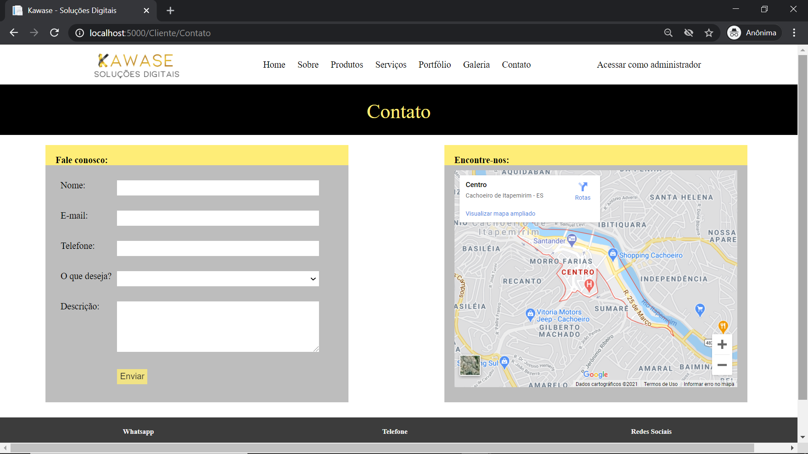
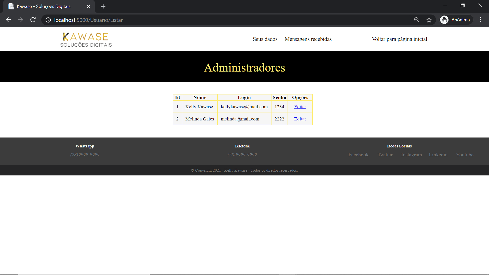
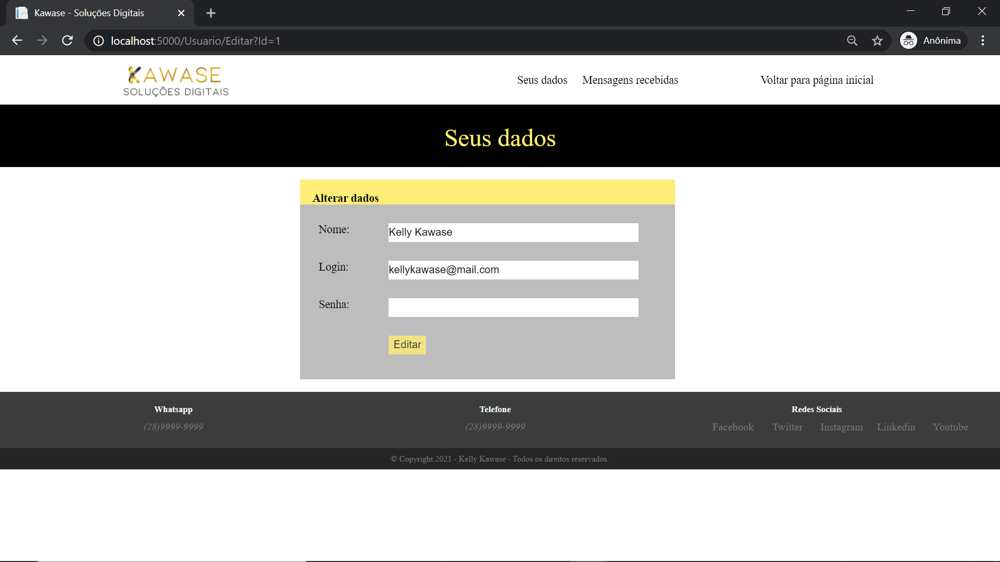
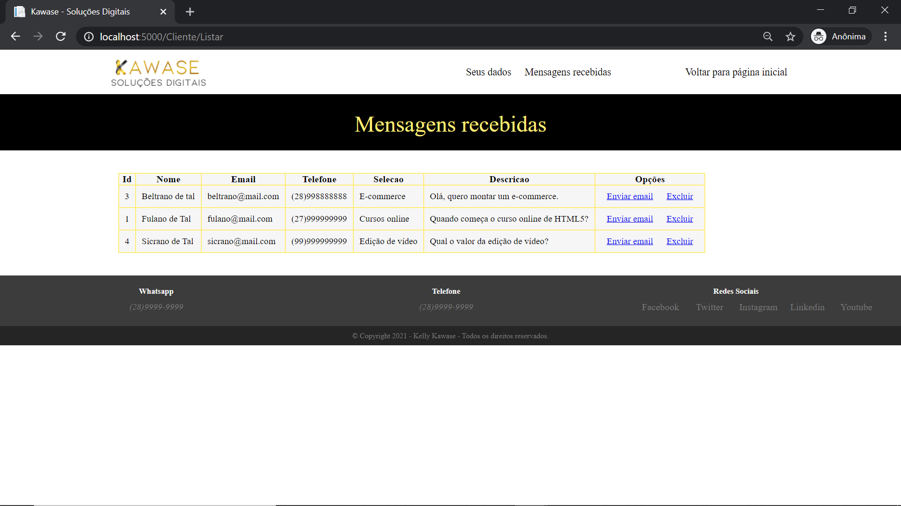
